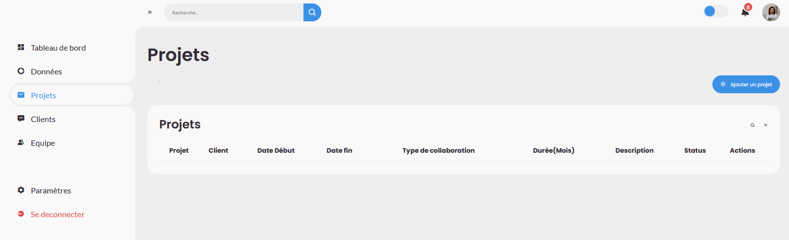
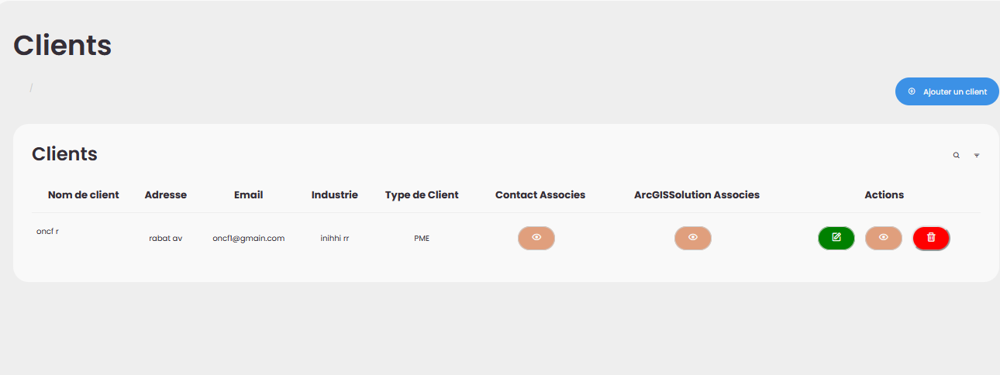

<h3>dans l'image ci-après nous avons une page d'acceuil après une authentification </h3>

<h3>pour un compte Admin qui a des privilèges :  </h3>
 <h3>
Activation/Désactivation : L'admin peut activer ou désactiver les comptes utilisateurs.
Réinitialisation de Mot de Passe : L'admin peut réinitialiser le mot de passe d'un utilisateur et lui envoyer un nouveau.
Modification : L'admin peut modifier les informations personnelles d'un utilisateur.
Ajout d'Utilisateur : L'admin peut créer un nouveau compte avec un rôle spécifique.
Gestion Sécurisée : Seules les actions autorisées sont accessibles grâce aux rôles.
 </h3>
 
 
 
 
 
 <h3>Dans l'image ci-après, l'admin, après la réinitialisation d'un compte, a envoyé un code au mail de l'utilisateur concerné pour créer un nouveau mot de passe</h3>
 
 <h3>Un compte utilisateur peut modifier ses informations ainsi que son mot de passe, mais doit envoyer une demande de changement de mot de passe à l'admin</h3>
 
 <h3>l'Administrateur réçu une notification  contient les informations d'utilisateur qui a envoyé la demande de changer son mot de passe, la notification contient semail et nom d'utilisateur et la date d'envoie de la demande</h3>

 
 <h3>l'utilsateur aussi a des privilèges suivants tel que l'ajout d'un projet ou donnée ou client (ajouter et modifier et consulter) :  </h3>

   
